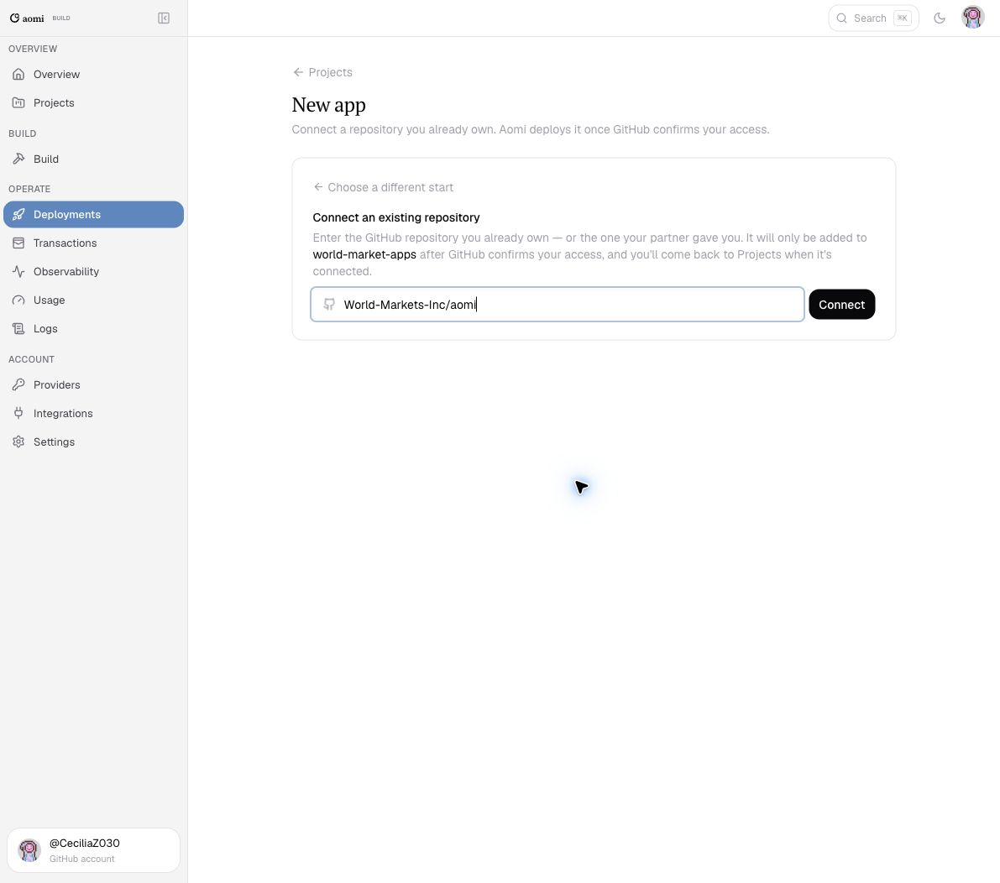

# World Markets Agent

An Aomi app for live World Markets context on the UniFi testnet.

The app reads the World exchange contract directly and exposes typed tools in two
groups.

Live contract reads and execution (mandate-aware):

- `list_world_assets`
- `get_world_account`
- `render_lookup`
- `warm_account`
- `get_health_snapshot`
- `get_strategy_snapshot`
- `get_world_market`
- `get_world_rates`
- `get_world_loans`
- `preview_world_trade`
- `check_world_mandate`
- `execute_world_order`
- `cancel_world_order`
- `execute_world_swap`
- `renew_world_loans`
- `get_world_agent_permission`
- `get_world_open_orders`
- `get_world_research`
- `get_world_tasks`
- `set_world_watch`
- `set_world_preference`
- `cancel_world_task`
- `drain_world_outbound`

Reporting-service tools (the honest-numbers layer — deterministic derived figures
so the message layer never authors a number; see `src/skill/` and the
`TELEGRAM-MESSAGING-UX-SPEC`):

- `get_world_pnl`
- `preview_account_effect`
- `compute_resize`
- `preview_exit`
- `plan_large_order`
- `get_dollarpower`
- `simulate_guardian_unwind`
- `check_negative_carry`

Version 0.4 is mandate-aware. Local `aomi-run` can place, cancel, swap, and
extend loans through a Node sidecar (`sidecar/`) that holds `WORLD_PRIVATE_KEY`
and calls `@wcm-inc/sdk`. Research, watches, and preferences go through a
second unsigned sidecar (`brain/`) that holds no key. The Rust plugin never
sees the key. Hosted Aomi signing is not in this release.

The mandate still fail-closes without a bound policy document. Post-trade RAPV is
derived from ATLAS `evaluate` at unit risk, anchored to the live contract RAPV,
and labeled as an estimate. If that derivation cannot run, the mandate fail-closes.

## Validate

```sh
cargo fmt --all -- --check
cargo clippy --all-targets -- -D warnings
cargo test
cargo test reads_live_world -- --ignored --nocapture
cargo build --release
```

## Interactive sanity (aomi-run)

[`aomi-run`](https://aomi.dev/docs/build/toolchain/aomi-run) is the local dev
runtime: it loads this plugin, calls a real LLM, and shows which tools the model
selects. It is **not** the hosted Telegram backend.

```sh
# plugin only (reads, previews)
cargo build
aomi-run target/debug/libworld_markets.dylib \
  --env-file .env --provider openrouter

# plugin + local execution sidecar (requires WORLD_PRIVATE_KEY)
chmod +x scripts/dev-run.sh
./scripts/dev-run.sh
```

On Linux use `libworld_markets.so`. `/help` inside the REPL lists only host
commands (`/quit`, `/reset`, …) — not agent lookup tokens. Terse lookups (`b`,
`p`, `r`, …) are plain messages, not slash commands.

Set `WORLD_ACCOUNT_ID` in `.env` (not only on the shell command line) so the
plugin process inherits it via `--env-file`. `aomi-run` returns `None` for all
handover state attributes per the
[aomi-run docs](https://aomi.dev/docs/build/toolchain/aomi-run#what-the-dev-runtime-stubs).
`aomi-run` has no `handover_mandate`, so the plugin uses a bundled placeholder
policy (WETH/USDT, see `mandate.dev.example.json`) unless you set
`WORLD_MANDATE_PATH` to a real file or to `none`. Start the sidecar so execute
tools can submit.

Smoke prompts:

- `b` → one line: `Portfolio [#].` (`render_lookup`; hosted Aomi should skip the LLM — see below)
- "What can't you do?" → §6.1 incapacity message (no numbers)
- "How am I doing?" → health card via `get_health_snapshot`
  (`get_world_account` / `get_world_pnl` / `get_dollarpower` in one call)

### Fast lookups (host contract)

Terse tokens (`b`/`p`/`r`/`a`/`d`, their word forms, `?` / commands / shortcuts) can
answer in ~500ms only if the host **does not call the LLM**.

1. On **every user message**, call `render_lookup` with `text` set to the whole message
   (including greetings and health questions). Unmatched text still prefetches the account
   so a later `b`/`p`/`r` is a cache hit.
2. If `skip_llm` is true, send `message` verbatim and stop.
3. Otherwise run the normal LLM loop (`how am I doing?`, previews, trades).

The plugin keeps that cache warm: it refreshes every 60 seconds while the session is
active (activity in the last 3 minutes) and rebuilds immediately after a successful
trade, cancel, swap, or loan action. `warm_account` remains available if the host
wants an explicit prefetch.

`aomi-run` does not intercept; the model should still call `render_lookup` and paste
`message`. Natural-language lookups ("what's my balance?") stay on the LLM path and
may pass `token` (`b`/`p`/`r`/`a`/`d`) into `render_lookup`.

PnL persistence (until Aomi host storage is agreed): realized and closed-position
figures are written under `WORLD_PNL_DIR`, else
`$XDG_DATA_HOME/aomi/world-markets/pnl`. Open PnL is live from the contract.

Deploy against the real backend for live handover and mandate context. Hosted
execution waits on Aomi's key-holding design; local execution uses the sidecar.

## Mini App (local)

[`world-mini-app`](mini-app/) is the Telegram Mini App UI (ledger, portfolio,
charts, voice compose). It is **not** started by `aomi-run` or `dev-run.sh`.

**Full local experience** (Mini App browser tabs + agent chat CLI + sidecars):

```sh
chmod +x scripts/dev-full.sh
./scripts/dev-full.sh
```

That one script starts brain, execution sidecar (when `WORLD_PRIVATE_KEY` is
set), the mini-app server, opens portfolio + chart tabs, and runs **interactive
`aomi-run`** in the terminal — the same agent thread you used before in the CLI.

Mini App UI only (no agent REPL): `./scripts/dev-mini-app.sh --open`

Agent REPL only (no Mini App): `./scripts/dev-run.sh`

Set in `.env` for browser dev:

- `WORLD_ACCOUNT_ID` — account bound to portfolio/ledger views
- `OPENROUTER_API_KEY` — required for `aomi-run`
- `MINI_APP_DEV_BYPASS=1` — skip Telegram auth on localhost
- `WORLD_PRIVATE_KEY` — optional; enables live trade flush via sidecar

URLs after startup:

- Portfolio: `http://127.0.0.1:8080/?preview=dev`
- Chart: `http://127.0.0.1:8080/chart?symbol=AAPL&period=d&preview=dev`
- Utterance ontology (localhost only): `http://127.0.0.1:8080/dev/ontology?preview=dev`

Speech and typed compose share one vocabulary file,
[`assets/speech_ontology.json`](assets/speech_ontology.json). The local page
shows when to add an alias or a speech confusable; production never writes that
JSON. Operator runbook: [`docs/USER-GUIDE-utterance-ontology.md`](docs/USER-GUIDE-utterance-ontology.md).

Options: `dev-full.sh --no-open`, `--no-cli`, `--no-sidecar`, `--help`.

## Deploy

An owner or repository administrator must first open the
[World Markets staging import page](https://build-staging.aomi.dev/operate/deployments/new?platform=world-market-apps&mode=import),
confirm the `world-market-apps` platform, and connect `World-Markets-Inc/aomi`.
Scope the staging Aomi GitHub App to this repository rather than every
organization repository.



If Build reports that `.aomi/config.json` uses `world-market-apps` but the
Project uses `community`, no Project was created. Reopen the scoped staging
link above and retry on `world-market-apps`.

After the Project is connected:

```sh
cargo install --git https://github.com/aomi-labs/aomi-sdk \
  --features cli,dev-runtime aomi-sdk
aomi-build login \
  --build-url https://build-staging.aomi.dev \
  --backend https://api-staging.aomi.dev
```

After each code update, validate, commit, and push the exact revision that
should run:

```sh
cargo test
cargo build --release
git push

aomi-build deploy preflight --repo World-Markets-Inc/aomi
aomi-build deploy --repo World-Markets-Inc/aomi
aomi-build deploy status
```

Deployment uses the pushed Git commit, not uncommitted working-tree changes.
`.aomi/deployment.json` is local lifecycle state and must not be committed.
